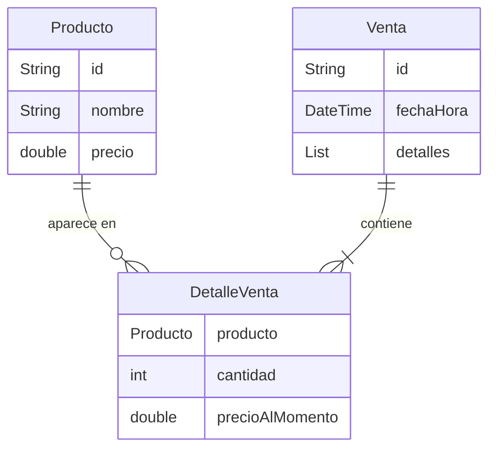

## Diagrama entidad-relación

## Relaciones

### Venta y DetalleVenta

Una `Venta` contiene uno o más elementos de `DetalleVenta`.

Cada `DetalleVenta` pertenece a una sola venta y representa un producto
incluido dentro de esa operación.

La relación es:

**Venta 1 → N DetalleVenta**

### Producto y DetalleVenta

Cada `DetalleVenta` referencia exactamente un `Producto`.

Un producto puede existir en el catálogo sin haberse vendido todavía, por lo
que puede aparecer en cero o muchos detalles de venta a lo largo del tiempo.

La relación es:

**Producto 1 → 0..N DetalleVenta**

## Función de DetalleVenta

`DetalleVenta` conecta conceptualmente una venta con los productos incluidos
en ella.

Además de identificar el producto vendido, conserva:

- `cantidad`: número de unidades vendidas.
- `precioAlMomento`: precio utilizado cuando se realizó la venta.

Guardar `precioAlMomento` permite conservar el valor histórico de la venta
aunque posteriormente cambie el precio actual del producto en el catálogo.

## Alcance

Este documento representa únicamente el modelo conceptual definido por las
clases Dart actuales.

No define nombres de tablas, tipos de columnas de SQLite, llaves foráneas ni
sentencias SQL. La transformación de este modelo a un esquema de base de datos
corresponde al siguiente issue.