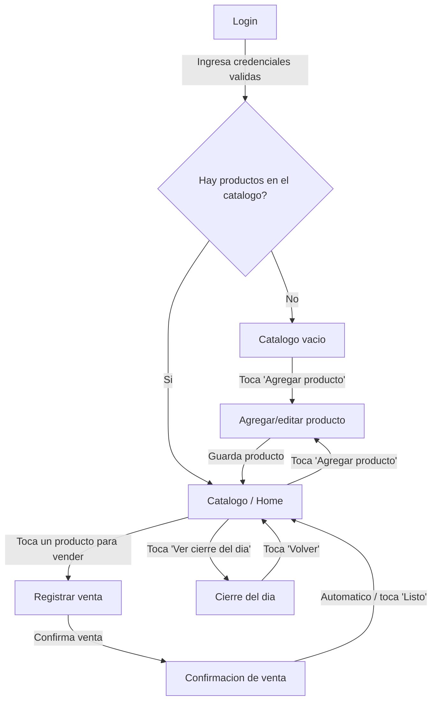

# Diagrama de pantallas y navegación — MVP (M1)

## Contexto

Este diagrama define todas las pantallas del flujo principal del MVP y las
acciones que llevan de una a otra, para que Arquitectura pueda definir las
rutas de la aplicación. No incluye el contenido visual de cada pantalla
(eso corresponde a diseño de UI).

Alcance basado en el flujo principal descrito en el README de Cabal:
**"Abre la app → registra cada venta durante el día → ve qué productos se
movieron y cuáles no."**

Solo se incluyen pantallas correspondientes a lo que **sí entra en M1**:
login (confirmado con Arquitectura por seguridad), catálogo mínimo (nombre
y precio), registro de venta, vista de cierre del día. No se incluyen
pantallas de control de existencias, alertas de stock, caducidad, fiado,
compras a proveedores, multiusuario ni código de barras, por estar
explícitamente fuera de alcance.

## Pantallas del flujo principal

| # | Pantalla | Descripción breve |
|---|---|---|
| 1 | Login | Ingreso del tendero a la app, por seguridad (confirmado con Arquitectura) |
| 2 | Catálogo / Home | Lista de productos (nombre y precio) |
| 3 | Catálogo vacío | Estado especial cuando no hay productos cargados todavía |
| 4 | Agregar/editar producto | Formulario mínimo: nombre y precio |
| 5 | Registrar venta | Selección rápida del producto vendido, para registrar durante la atención |
| 6 | Confirmación de venta | Confirmación breve de que la venta quedó registrada |
| 7 | Cierre del día | Vista de qué productos se vendieron y cuáles no durante el día |

## Diagrama de navegación

## Consideración de diseño: la suposición más riesgosa

El README identifica como riesgo principal que el tendero no tenga tiempo de
registrar cada venta mientras atiende solo, en horas pico, con cola de
clientes. Por eso el camino "Catálogo → Registrar venta → Confirmación" debe
mantenerse en el mínimo de toques posible; no se agregan pasos intermedios
(confirmaciones dobles, formularios largos, pantallas de carga) en esa ruta.

## Notas sobre el caso "catálogo vacío"

Al abrir la app por primera vez, o si el tendero eliminó todos sus productos,
debe mostrarse un estado vacío con una llamada a la acción clara ("Agregar
tu primer producto") en lugar de una lista en blanco.

## Fuera de alcance

- Contenido visual (wireframes/mockups) de cada pantalla.
- Pantallas de: control de existencias, alertas de stock bajo, fechas de
  caducidad, fiado, compras a proveedores, multiusuario, código de barras —
  todas explícitamente fuera de M1 según el README.